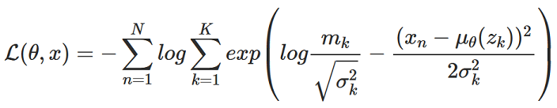
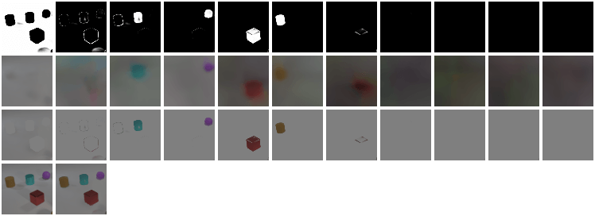
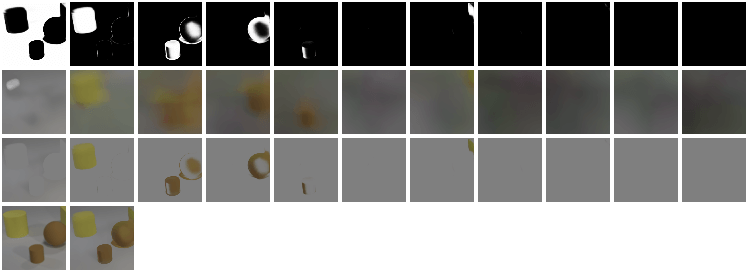

# MONet in PyTorch

We provide a PyTorch implementation of [MONet](https://arxiv.org/abs/1901.11390).

This project is built on top of the [CycleGAN/pix2pix](https://github.com/junyanz/pytorch-CycleGAN-and-pix2pix) code written by [Jun-Yan Zhu](https://github.com/junyanz) and [Taesung Park](https://github.com/taesung), and supported by [Tongzhou Wang](https://ssnl.github.io/).

**Note**: The implementation is developed and tested on Python 3.7 and PyTorch 1.1.

## Implementation details
### Decoder Negative Log-Likelihood (NLL) loss
<!--
MathJax source:

$$\begin{equation}\begin{aligned}

\mathcal{L}_{dec}(\theta, \mathbf{x}, \mathbf{m}, \mathbf{z}) &= -\log \sum_{k=1}^K \mathbf{m}_k p_\theta(\mathbf{x} | \mathbf{z}_k) && \text{First term of Eq. 3} \\

 &= -\log \sum_{k=1}^K \mathbf{m}_k {1 \over \sigma_k \sqrt{2\pi}} \exp \left( - {(\mathbf{x}  -\mu_\theta(\mathbf{z}_k))^2  \over 2\sigma_k^2} \right) \\

 &= -\log {1 \over \sqrt{2\pi}} \sum_{k=1}^K \exp \left( \log{\mathbf{m}_k \over \sigma_k} - {(\mathbf{x}  -\mu_\theta(\mathbf{z}_k))^2  \over 2\sigma_k^2} \right) \\

 &= - \sum_{i=1}^I \log \sum_{k=1}^K \exp \left( \log{\mathbf{m}_k \over \sigma_k} - {(\mathbf{x}  -\mu_\theta(\mathbf{z}_k))^2  \over 2\sigma_k^2} \right) && \text{Sum over I pixels}

\end{aligned}\end{equation}$$
-->


where *I* is the number of pixels in the image, and *K* is the number of mixture components. The inner term of the loss function is implemented using `torch.logsumexp()`. Each pixel of the decoder output is assumed to be iid Gaussian, where sigma (the "component scale") is a fixed scalar (See Section B.1 of the Supplementary Material).

## Test Results
### CLEVR 64x64 @ 160 epochs
The first three rows correspond to the Attention network outputs (masks), raw Component VAE (CVAE) outputs, and the masked CVAE outputs, respectively. Each column corresponds to one of the K mixture components.

For the fourth row, the first image is the ground truth while the second one is the composite image created by the pixel-wise addition of the K component images (third row).





## Prerequisites
- Linux or macOS (not tested)
- Python 3.7
- CPU or NVIDIA GPU + CUDA 10 + CuDNN

## Getting Started
### Installation

- Clone this repo:
```bash
git clone https://github.com/baudm/MONet-pytorch.git
cd MONet-pytorch
```

- Install [PyTorch](http://pytorch.org and) 1.1+ and other dependencies (e.g., torchvision, [visdom](https://github.com/facebookresearch/visdom) and [dominate](https://github.com/Knio/dominate)).
  - For pip users, please type the command `pip install -r requirements.txt`.
  - For Conda users, we provide a installation script `./scripts/conda_deps.sh`. Alternatively, you can create a new Conda environment using `conda env create -f environment.yml`.
  - For Docker users, we provide the pre-built Docker image and Dockerfile. Please refer to our [Docker](docs/docker.md) page.

### MONet train/test
- Download a MONet dataset (e.g. CLEVR):
```bash
wget -cN https://dl.fbaipublicfiles.com/clevr/CLEVR_v1.0.zip
```
- To view training results and loss plots, run `python -m visdom.server` and click the URL http://localhost:8097.
- Train a model:
```bash
python train.py --dataroot ./datasets/CLEVR_v1.0 --name clevr_monet --model monet
```
To see more intermediate results, check out `./checkpoints/clevr_monet/web/index.html`.

To generate a montage of the model outputs like the ones shown above:
```bash
./scripts/test_monet.sh
./scripts/generate_monet_montage.sh
```

### Apply a pre-trained model
- Download pretrained weights for CLEVR 64x64:
```bash
./scripts/download_monet_model.sh clevr
```
